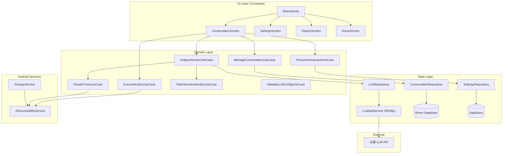
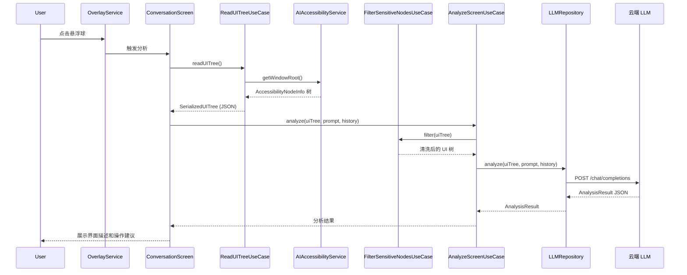
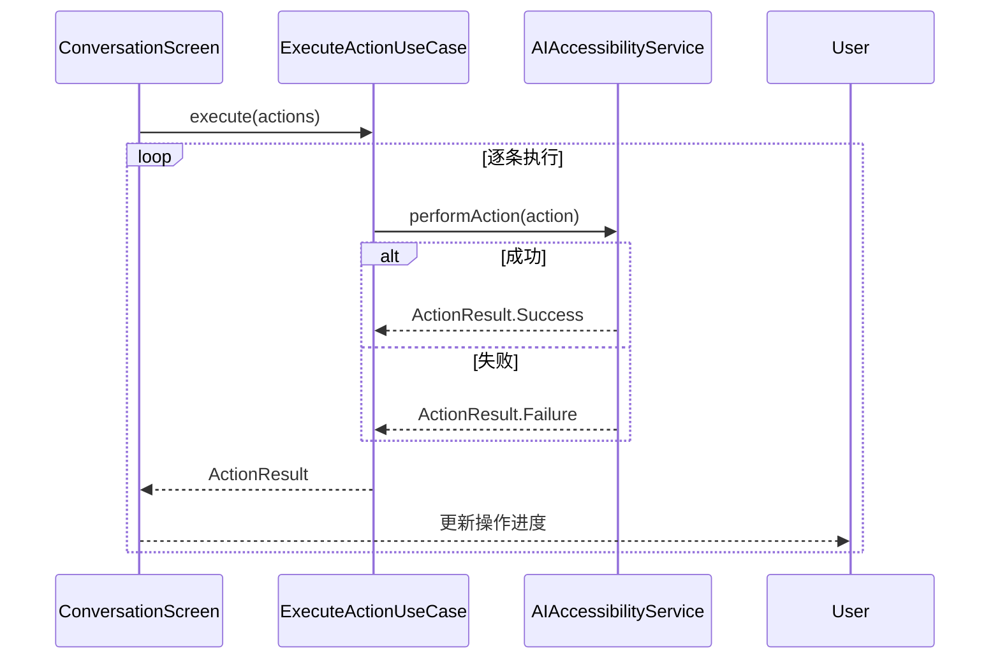

# 系统架构

## 概述

AI 屏幕助手是一款 Android 客户端应用，通过 AccessibilityService 读取当前界面的 UI 树结构，将界面的结构化文本描述发送至云端大语言模型 (LLM) 进行分析，同时通过 AccessibilityService 执行自动化操作。应用支持建议模式和自主执行模式双模式切换，提供悬浮球、语音输入等快捷交互入口。

## 技术栈

**语言与运行时**
- Kotlin 1.9.24
- JVM 17
- Android SDK 34 (min 26)

**框架**
- Jetpack Compose (BOM 2024.06.00) - UI 框架
- Jetpack Navigation Compose 2.7.7 - 页面导航
- Hilt 2.51.1 - 依赖注入
- Room 2.6.1 - 本地数据库
- DataStore 1.1.1 - 键值存储

**网络**
- OkHttp 4.12.0 - HTTP 客户端
- kotlinx-serialization-json 1.7.1 - JSON 序列化

**异步**
- Kotlin Coroutines 1.8.1
- Kotlin Flow - 响应式数据流

**测试**
- JUnit 4.13.2 - 单元测试
- MockK 1.13.12 - Mock 框架
- Compose UI Test - UI 测试

**Android 系统 API**
- AccessibilityService - UI 树读取和操作执行
- WindowManager - 悬浮窗管理
- SpeechRecognizer - 语音识别

## 项目结构

```
workspace/
├── app/                                    # 应用模块
│   ├── build.gradle.kts                    # 模块构建配置
│   └── src/main/
│       ├── AndroidManifest.xml             # 清单文件
│       ├── res/                            # 资源文件
│       │   ├── values/                     # 字符串、颜色、主题
│       │   └── xml/                        # 无障碍服务配置
│       └── java/com/monkeycode/aiscreen/
│           ├── AIHelperApplication.kt      # 应用入口
│           ├── MainActivity.kt             # 主 Activity (Compose + Navigation + BroadcastReceiver)
│           ├── core/                       # 核心层
│           │   ├── data/                   # Repository 实现
│           │   │   ├── datastore/          # DataStore 配置
│           │   │   ├── local/              # Room 数据库 + DAO + Entity
│           │   │   ├── network/            # LLMApiService + NetworkMonitor
│           │   │   └── repository/         # Repository 实现
│           │   ├── domain/                 # UseCase 实现 + AccessibilityServiceBridge
│           │   ├── model/                  # 数据模型
│           │   └── serializer/             # UI 树序列化
│           ├── feature/                    # 功能界面 (ViewModel)
│           │   ├── conversation/           # ConversationViewModel
│           │   ├── settings/               # SettingsViewModel
│           │   └── history/                # HistoryViewModel
│           ├── service/                    # Android 服务
│           │   ├── accessibility/          # 无障碍服务
│           │   └── overlay/                # 悬浮球服务
│           ├── ui/                         # Compose UI 组件
│           │   ├── navigation/             # Screen 路由 + NavGraph
│           │   ├── screen/                 # 4 个 Screen composable
│           │   └── theme/                  # Material3 主题
│           └── di/                         # Hilt 依赖注入模块
├── build.gradle.kts                        # 项目级构建配置
└── settings.gradle.kts                     # 项目设置
```

### 包结构说明

| 包 | 层级 | 职责 |
|----|------|------|
| `core.model` | 核心 | 数据模型定义（Action, Conversation, Message 等） |
| `core.domain` | 核心 | 业务逻辑 UseCase + AccessibilityServiceBridge |
| `core.data.datastore` | 核心 | Preferences DataStore 配置持久化 |
| `core.data.local` | 核心 | Room 数据库、DAO、Entity |
| `core.data.network` | 核心 | LLMApiService (OkHttp) + NetworkMonitor |
| `core.data.repository` | 核心 | LLMRepository, ConversationRepository, SettingsRepository |
| `core.serializer` | 核心 | AccessibilityNodeInfo -> SerializedUITree 转换 |
| `feature.conversation` | 功能 | ConversationViewModel |
| `feature.settings` | 功能 | SettingsViewModel |
| `feature.history` | 功能 | HistoryViewModel |
| `ui.navigation` | UI | Compose 路由 + NavGraph |
| `ui.screen` | UI | Compose Screen composable (Home, Conversation, Settings, History) |
| `ui.theme` | UI | Material3 Light/Dark 主题 |
| `service.accessibility` | 服务 | AIAccessibilityService (读取 UI 树 + 执行操作) |
| `service.overlay` | 服务 | OverlayService (可拖拽悬浮球 + 通知栏) |
| `di` | 基础设施 | Hilt AppModule (OkHttp, Room DB, DAO, Bridge 提供) |

## 系统架构



## 核心交互流

### 分析流程



### 操作执行流程



## 数据模型关系

```mermaid
erDiagram
    Conversation ||--o{ Message : contains
    Conversation ||--o{ UITreeRecord : snapshots
    Message ||--o| AnalysisResult : has
    AnalysisResult ||--o{ UIElementReference : references
    AnalysisResult ||--o{ Action : actions
    SerializedUITree ||--o{ UIElement : elements
    LLMConfig ||--|| SettingsRepository : stored_in
    OperationMode ||--|| SettingsRepository : stored_in
