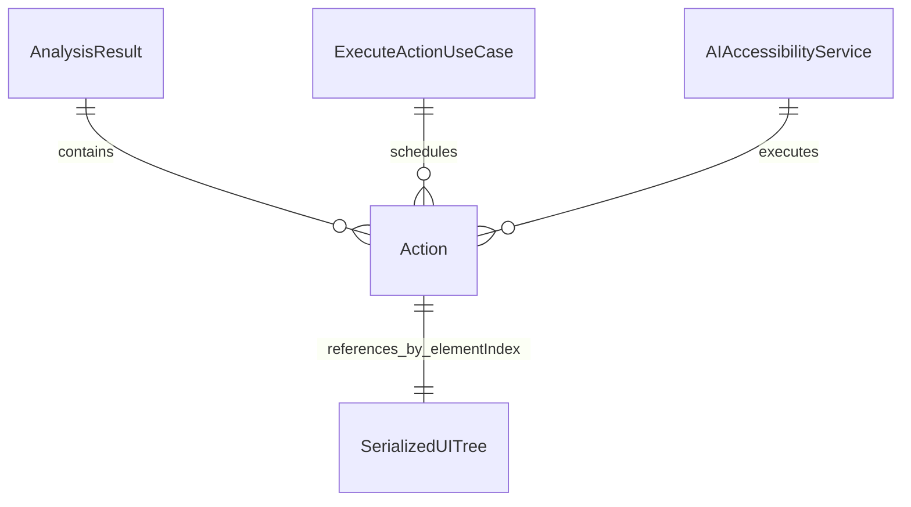

# Action

Action 是系统可执行的自动化操作指令，由 LLM 根据界面分析生成，通过 AIAccessibilityService 在设备上执行。

## 什么是 Action？

Action 封装了 Android 手机上的单一交互操作。LLM 分析当前 UI 树后，返回一组 Action 序列，系统按序执行以完成用户的目标（如"在搜索框中输入'天气'并点击搜索"）。

## 代码位置

| 方面 | 位置 |
|------|------|
| 定义 | `core/model/Action.kt` |
| 执行 | `service/accessibility/AIAccessibilityService.kt` |
| 调度 | `core/domain/ExecuteActionUseCase.kt` |

## 结构

```kotlin
sealed class Action {
    data class Click(val elementIndex: Int) : Action()
    data class LongClick(val elementIndex: Int) : Action()
    data class InputText(val elementIndex: Int, val text: String) : Action()
    data class Swipe(
        val startX: Int, val startY: Int,
        val endX: Int, val endY: Int,
        val duration: Long = 300
    ) : Action()
    object PressBack : Action()
    data class ScrollForward(val elementIndex: Int) : Action()
    data class ScrollBackward(val elementIndex: Int) : Action()
    data class OpenApp(val packageName: String) : Action()
}
```

### 操作类型说明

| 类型 | 说明 | 关键参数 |
|------|------|----------|
| `Click` | 点击指定元素 | `elementIndex`: 元素在 SerializedUITree.elements 的下标 |
| `LongClick` | 长按指定元素 | `elementIndex` |
| `InputText` | 向输入框输入文字 | `elementIndex` + `text` |
| `Swipe` | 从起点滑动到终点 | `startX/Y`, `endX/Y`, `duration` |
| `PressBack` | 按下返回键 | 无参数 |
| `ScrollForward` | 在可滚动容器中向下滚动 | `elementIndex` |
| `ScrollBackward` | 在可滚动容器中向上滚动 | `elementIndex` |
| `OpenApp` | 通过包名启动应用 | `packageName` |

## 不变量

1. **elementIndex 有效性**: 执行前必须校验 elementIndex 在 SerializedUITree.elements 的合法范围内
2. **操作原子性**: 每个 Action 独立执行，上一步的失败不影响下一步的调度（连续失败有全局暂停机制）
3. **坐标合法性**: Swipe 的坐标必须在屏幕范围 (0, 0) 到 (displayWidth, displayHeight) 内

## 关系



## 执行流程

1. `ExecuteActionUseCase` 接收 Action 列表
2. 遍历每个 Action，调用 `AIAccessibilityService.performAction(action)`
3. `performAction` 根据类型分发：
   - Click/LongClick/InputText → `findAccessibilityNodeInfo(elementIndex).performAction()`
   - Swipe → `dispatchGesture(GestureDescription)`
   - PressBack → `performGlobalAction(GLOBAL_ACTION_BACK)`
   - ScrollForward/Backward → `performAction(ACTION_SCROLL_FORWARD/BACKWARD)`
   - OpenApp → `context.packageManager.getLaunchIntentForPackage().let { startActivity(it) }`
4. 每步结果通过 Flow 发回，连续 3 次失败触发全局暂停
