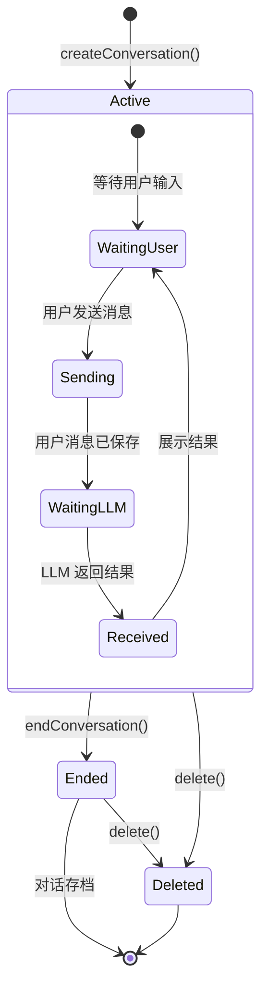
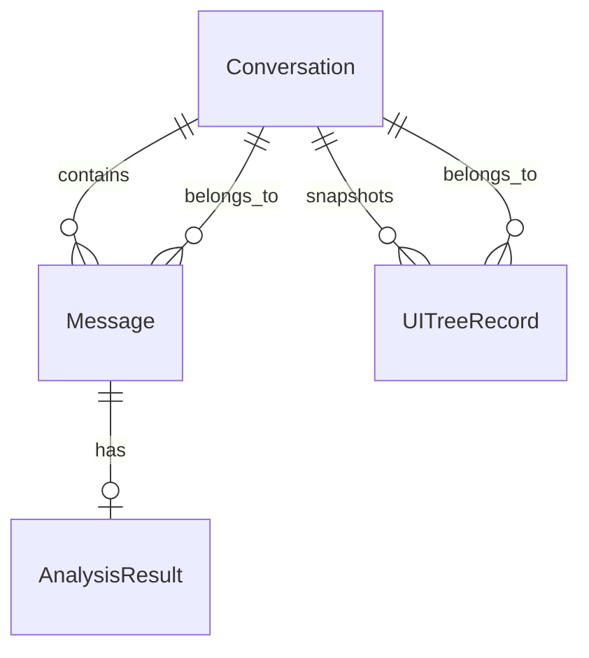

# Conversation

Conversation 代表用户与 LLM 助手之间的一次完整交互会话，包含所有消息和每次交互时的界面快照。

## 什么是 Conversation？

当用户点击悬浮球触发分析时，会创建或延续一个 Conversation。每次用户发送指令和 AI 返回分析结果都作为 Message 追加到当前 Conversation 中。用户可随时结束当前会话或开始新会话。

## 代码位置

| 方面 | 位置 |
|------|------|
| 模型 | `core/model/Conversation.kt` |
| Entity | `core/data/entity/ConversationEntity.kt` |
| DAO | `core/data/dao/ConversationDao.kt` |
| Repository | `core/data/ConversationRepository.kt` |
| UseCase | `core/domain/ManageConversationUseCase.kt` |

## 结构

```kotlin
data class Conversation(
    val id: String,                     // UUID
    val title: String,                  // 对话摘要标题
    val createdAt: Long,                // 创建时间戳
    val updatedAt: Long,                // 最后更新时间戳
    val messages: List<Message>,        // 消息列表
    val uiTreeRecords: List<UITreeRecord>  // UI 树快照
)

data class Message(
    val id: String,                     // UUID
    val role: MessageRole,              // USER 或 ASSISTANT
    val content: String,                // 消息文本
    val analysisResult: AnalysisResult?, // 仅 ASSISTANT 消息包含
    val timestamp: Long                 // 消息时间戳
)

enum class MessageRole {
    USER,       // 用户消息
    ASSISTANT   // AI 分析结果
}

data class UITreeRecord(
    val id: String,
    val conversationId: String,         // 所属对话 ID
    val serializedTree: String,         // SerializedUITree JSON
    val timestamp: Long
)
```

## 不变量

1. **时间单调性**: messages 列表按 timestamp 严格递增
2. **角色交替**: ASSISTANT 消息紧跟 USER 消息（系统消息作为背景发送不存为单独 Message）
3. **缓存上限**: 最多保留 20 条对话，超出后 FIFO 清理最早记录
4. **UI 树关联**: 每条 ASSISTANT 消息的分析必须基于对应的 UITreeRecord

## 生命周期



## 关系



| 关联实体 | 关系 | 描述 |
|---------|------|------|
| Message | 包含 | 一个 Conversation 可有多个 Message，按时间排列 |
| UITreeRecord | 快照 | 每次分析时保存一份 UI 树快照 |
| AnalysisResult | 可选 | 仅 ASSISTANT 角色的 Message 包含分析结果 |
