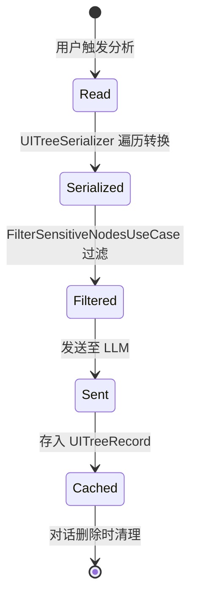

# SerializedUITree

SerializedUITree 是当前 Android 前台界面的结构化描述，通过 AccessibilityService 读取 UI 树后序列化为 JSON 格式。它是系统与 LLM 之间的核心数据交换格式。

## 什么是 UI 树？

UI 树代表用户当前在屏幕上看到的所有交互元素的层级结构。通过 AccessibilityService 获取的 AccessibilityNodeInfo 树包含每个控件的类型、文本、坐标和交互属性。

## 代码位置

| 方面 | 位置 |
|------|------|
| 模型 | `core/model/SerializedUITree.kt` |
| 序列化 | `core/serializer/UITreeSerializer.kt` |
| 读取 | `service/accessibility/AIAccessibilityService.kt` |
| 安全过滤 | `core/domain/FilterSensitiveNodesUseCase.kt` |

## 结构

```kotlin
data class SerializedUITree(
    val packageName: String,         // 当前前台应用包名
    val activityName: String?,       // 当前 Activity 名称
    val elements: List<UIElement>,   // 扁平化的可见元素列表
    val timestamp: Long              // 采集时间戳
)

data class UIElement(
    val id: String?,                 // resource-id
    val type: String,                // 控件类名 (Button, TextView, EditText...)
    val text: String?,               // 可见文本
    val contentDescription: String?, // 无障碍描述
    val hint: String?,               // 提示文字
    val bounds: Rect,                // 边界坐标
    val isClickable: Boolean,        // 是否可点击
    val isEditable: Boolean,         // 是否可编辑
    val isPassword: Boolean,         // 是否密码字段 (关键安全标识)
    val isChecked: Boolean?,         // 是否选中 (Switch/CheckBox)
    val isScrollable: Boolean,       // 是否可滚动容器
    val isFocused: Boolean,          // 是否当前焦点
    val childCount: Int,             // 子元素数量
    val depth: Int                   // 层级深度
)
```

### 关键字段

| 字段 | 类型 | 描述 | 约束 |
|------|------|------|------|
| `packageName` | `String` | 当前前台应用包名 | 非空 |
| `elements` | `List<UIElement>` | 可见元素列表 | 可能为空 |
| `isPassword` | `Boolean` | 密码字段标识 | 过滤标志位 |
| `bounds` | `Rect` | 元素在屏幕上的位置 | 用于操作定位 |

## 不变量

1. **深度一致性**: 子元素的 depth 必须是父元素 depth + 1
2. **索引稳定性**: elements 列表的索引在单次读取中不可变，Action 中的 elementIndex 依赖此稳定性
3. **安全过滤不可逆**: 一旦 isPassword=true 的元素被过滤，原始文本不可恢复

## 生命周期



| 状态 | 描述 | 触发条件 |
|------|------|----------|
| Read | AccessibilityService 读取原始树 | 用户点击悬浮球或触发分析 |
| Serialized | 序列化为扁平元素列表 | 读取完成自动执行 |
| Filtered | 密码字段已过滤 | 发送 LLM 前自动执行 |
| Sent | 已发送至 LLM | 网络请求完成 |
| Cached | 存入本地数据库 | 对话保存时关联 |
