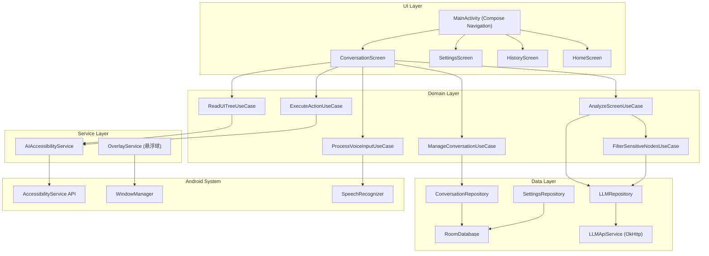
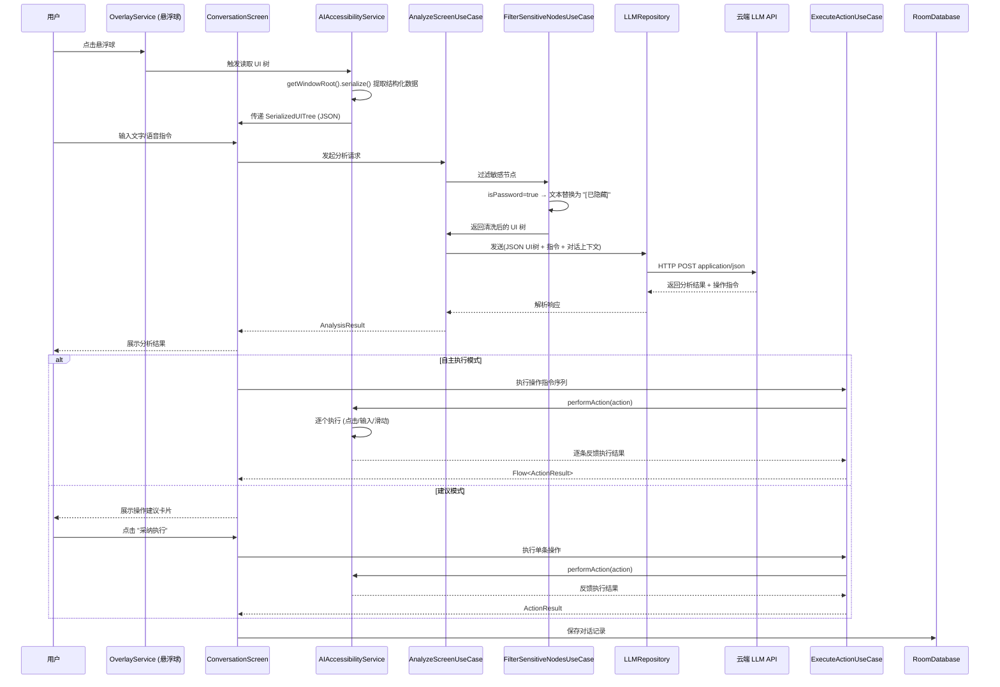

# AI 屏幕助手

Feature Name: ai-screen-assistant
Updated: 2026-06-23

## Description

AI 屏幕助手是一款 Android 客户端应用，通过 AccessibilityService 读取当前界面的 UI 树结构，将界面结构化文本描述（而非截图）发送至云端 LLM 进行分析，同时通过 AccessibilityService 执行自动化操作。相比基于截图的方案，文本化 UI 树传输更省流量、LLM 推理精度更高（直接获得元素坐标和属性），且无需 MediaProjection 权限。支持建议模式和自主执行模式双模式切换，提供悬浮球、语音输入等快捷交互入口。

## Architecture

### 分层架构



### 核心交互流



## Components and Interfaces

### 1. UI Layer (Jetpack Compose)

| 组件 | 职责 | 依赖 |
|------|------|------|
| `MainActivity` | 单 Activity 入口，管理 Compose Navigation | NavHost, ViewModels |
| `HomeScreen` | 主屏幕，功能入口导航、权限状态概览 | - |
| `ConversationScreen` | 对话界面，消息列表 + 输入栏 + 模式切换 + 当前界面简要信息 | ConversationViewModel |
| `SettingsScreen` | LLM 配置、操作模式偏好 | SettingsViewModel |
| `HistoryScreen` | 对话历史列表和详情 | HistoryViewModel |
| `ModeSwitchChip` | 操作模式切换芯片组件 | ConversationViewModel |

### 2. Service Layer (Android Services)

**AIAccessibilityService** (核心服务，同时承担读取和执行)
- 继承 `AccessibilityService`
- 读取职责：遍历 UI 树，提取每个节点的关键属性并序列化为 JSON
- 执行职责：根据 Action 指令模拟点击、输入、滑动、返回、滚动
- 对外接口：
  - `readUITree(): SerializedUITree` — 获取当前界面结构化描述
  - `performAction(Action): ActionResult` — 执行单个操作

**OverlayService**
- 继承 `Service`，通过 `WindowManager` 添加系统级悬浮窗
- 职责：维护悬浮球的显示、拖拽、点击/长按事件
- 对外接口：通过 `EventBus` 发送悬浮球交互事件

### 3. Domain Layer (Use Cases)

| Use Case | 输入 | 输出 | 对应需求 |
|----------|------|------|----------|
| `ReadUITreeUseCase` | - | SerializedUITree | R1 |
| `AnalyzeScreenUseCase` | SerializedUITree, String prompt, List\<Message\> history | AnalysisResult | R2 |
| `ExecuteActionUseCase` | List\<Action\> actions | Flow\<ActionResult\> | R4, R5 |
| `ManageConversationUseCase` | Conversation, Operation | Conversation | R9 |
| `ProcessVoiceInputUseCase` | AudioData | String (transcribed text) | R3 |
| `ValidateLLMConfigUseCase` | LLMConfig | ValidationResult | R8 |
| `FilterSensitiveNodesUseCase` | SerializedUITree | SerializedUITree (cleaned) | R7 |

### 4. Data Layer

**LLMRepository**
- 封装对云 LLM API 的调用
- 接口：`analyze(uiTree: SerializedUITree, prompt: String, history: List<Message>): Result<AnalysisResult>`
- 实现：OkHttp JSON POST，兼容 OpenAI Chat Completions 格式
- 请求体包含 system prompt（告知 LLM 当前是 Android UI 辅助场景，输出格式为 AnalysisResult JSON）

**ConversationRepository**
- 接口：`getHistory(): Flow<List<ConversationSummary>>`, `getConversation(id): Conversation`, `delete(id)`
- 实现：Room DAO

**SettingsRepository**
- 接口：`getLLMConfig(): Flow<LLMConfig>`, `saveLLMConfig(config)`, `getOperationMode(): Flow<OperationMode>`
- 实现：Room + DataStore

## Data Models

### SerializedUITree

```
SerializedUITree {
    packageName: String          // 当前前台应用的包名
    activityName: String?        // 当前 Activity 名称
    elements: List<UIElement>    // 扁平化的可见元素列表
    timestamp: Long
}
```

### UIElement

```
UIElement {
    id: String?                  // resource-id
    type: String                 // 控件类名 (e.g., "android.widget.Button")
    text: String?                // 可见文本内容
    contentDescription: String?  // 无障碍描述
    hint: String?                // 提示文字 (hint)
    bounds: Rect                 // 边界坐标 (left, top, right, bottom)
    isClickable: Boolean
    isEditable: Boolean
    isPassword: Boolean          // 是否为密码字段
    isChecked: Boolean?
    isScrollable: Boolean
    isFocused: Boolean
    childCount: Int
    depth: Int                   // 层级深度
}
```

### Conversation

```
Conversation {
    id: String (UUID)
    title: String
    createdAt: Long (timestamp)
    updatedAt: Long
    messages: List<Message>
    uiTreeSnapshots: List<UITreeRecord>
}
```

### Message

```
Message {
    id: String (UUID)
    role: Enum { USER, ASSISTANT }
    content: String
    analysisResult: AnalysisResult?   (nullable, only ASSISTANT)
    timestamp: Long
}
```

### AnalysisResult

```
AnalysisResult {
    screenDescription: String
    keyElements: List<UIElementReference>
    suggestionText: String
    actions: List<Action>
}
```

### UIElementReference

```
UIElementReference {
    elementIndex: Int            // 指向 SerializedUITree.elements 的下标
    label: String
    description: String
}
```

### Action (Sealed Class)

```
Action {
    // sealed subtypes:
    Click(elementIndex: Int)                     // 点击指定元素
    LongClick(elementIndex: Int)
    InputText(elementIndex: Int, text: String)   // 向指定输入框输入文字
    Swipe(startX, startY, endX, endY, duration: Long)
    PressBack
    ScrollForward(elementIndex: Int)             // 在指定可滚动容器中向下滚动
    ScrollBackward(elementIndex: Int)
    OpenApp(packageName: String)
}
```

### LLMConfig

```
LLMConfig {
    baseUrl: String
    apiKey: String
    modelName: String
    maxTokens: Int
    temperature: Float
}
```

### OperationMode

```
enum OperationMode {
    SUGGESTION,   // 建议模式
    AUTONOMOUS    // 自主执行模式
}
```

## LLM Prompt 设计

System Prompt 核心指令（发送至 LLM 时的系统消息）：

```
你是一个 Android 手机操作助手。用户会提供当前界面的 UI 树结构（JSON 格式），
包含每个元素的类型、文字、坐标和交互属性。你的任务是：
1. 理解用户意图
2. 描述当前界面
3. 如果用户想执行操作，给出精确的操作指令序列

操作指令使用以下 JSON 格式：
{
  "screenDescription": "...",
  "keyElements": [{"elementIndex": 0, "label": "搜索框", "description": "..."}],
  "suggestionText": "...",
  "actions": [
    {"type": "CLICK", "elementIndex": 3},
    {"type": "INPUT_TEXT", "elementIndex": 0, "text": "你好"}
  ]
}
```

## Correctness Properties

1. **UI 树读取完整性**: 每次读取必须遍历当前窗口所有可见元素，序列化后的元素列表与实际界面元素一一对应。
2. **操作元素定位准确性**: Action 中的 elementIndex 必须与实际 SerializedUITree.elements 下标一致，执行前校验下标有效性。
3. **对话上下文一致性**: 对话历史中的 message 列表按 timestamp 严格递增，不可出现时间倒序。
4. **敏感字段过滤不可逆**: `FilterSensitiveNodesUseCase` 检测 isPassword=true 的节点，将其 text 替换为 "[已隐藏]"，原始文本不进入任何网络传输。
5. **模式状态一致性**: UI 显示的操作模式与实际执行逻辑保持同步，切换模式后立即生效，无竞态。模式偏好写入 DataStore 后，下次启动自动恢复。

## Error Handling

| 错误场景 | 处理策略 | 用户反馈 |
|----------|----------|----------|
| 网络不可用 | 请求入队列，监听网络恢复后重试 | 顶部横幅 "当前无网络连接" |
| LLM API 超时 (30s) | 自动取消请求，保留输入供重试 | Toast + 重试按钮 |
| LLM API 返回 4xx/5xx | 解析错误体，分类处理 | 错误详情卡片 + 重试 |
| 无障碍服务未开启 | 禁止全部自动操作和 UI 读取 | 引导弹窗跳转系统无障碍设置 |
| AccessibilityService 操作超时 | 单步操作 5s 超时，记录失败 | 操作状态行标注失败 |
| 连续 3 次操作失败 | 暂停自动执行流程 | 对话框提示 "操作受阻，请手动介入" |
| Action elementIndex 超出范围 | 跳过该操作，继续执行下一条 | 操作状态行标注 "元素已变更" |
| 语音识别无结果 | 允许改用文字输入 | "未识别到语音，您可以输入文字" |
| 本地存储空间不足 | 清理最早的对话记录 (FIFO) | 下次进入历史页时提示 |
| 悬浮窗权限被系统回收 | 重新请求或在通知栏提供备选入口 | 通知栏入口 + 权限引导 |

## Test Strategy

### 单元测试

| 测试对象 | 覆盖重点 |
|----------|----------|
| `FilterSensitiveNodesUseCase` | isPassword 节点正确替换，非敏感节点不受影响 |
| `AnalyzeScreenUseCase` | 正确组装请求参数、AI 响应 JSON 解析、异常场景 |
| `ExecuteActionUseCase` | Action 分发逻辑、失败计数和暂停机制 |
| `ConversationRepository` | CRUD 操作正确性、分页查询 |
| `SettingsRepository` | LLMConfig 读写、OperationMode 持久化 |

### 集成测试

| 测试对象 | 覆盖重点 |
|----------|----------|
| `LLMRepository` + Mock LLM Server | 请求格式正确性、JSON 字段完整性、错误码处理 |
| `ConversationScreen` | 消息发送-响应完整流程、模式切换 UI 更新 |
| `HistoryScreen` | 列表加载、详情回看、删除操作 |

### UI 测试 (Compose Test)

| 测试对象 | 覆盖重点 |
|----------|----------|
| ConversationScreen | 消息气泡渲染、输入发送、模式切换芯片 |
| SettingsScreen | 表单输入验证、连接测试按钮 |
| ModeSwitchChip | 切换动画、模式标签变化 |

### 手动测试 / 设备测试

| 场景 | 验证方法 |
|------|----------|
| 悬浮球跨应用持久显示 | 在不同 App 间切换，确认悬浮球始终可见 |
| AccessibilityService UI 树读取 | 在不同 App 界面读取 UI 树，对比实际界面元素 |
| AccessibilityService 操作执行 | 对已知 App 界面执行点击/输入/滑动，目视确认 |
| 敏感字段过滤 | 在密码输入界面触发分析，检查 LLM 请求中密码字段是否已隐藏 |

## References

[^1]: (Android Developer Docs) - [AccessibilityService](https://developer.android.com/reference/android/accessibilityservice/AccessibilityService)
[^2]: (Android Developer Docs) - [AccessibilityNodeInfo](https://developer.android.com/reference/android/view/accessibility/AccessibilityNodeInfo)
[^3]: (Android Developer Docs) - [SpeechRecognizer](https://developer.android.com/reference/android/speech/SpeechRecognizer)
[^4]: (OpenAI Docs) - [Chat Completions API](https://platform.openai.com/docs/guides/text-generation)
