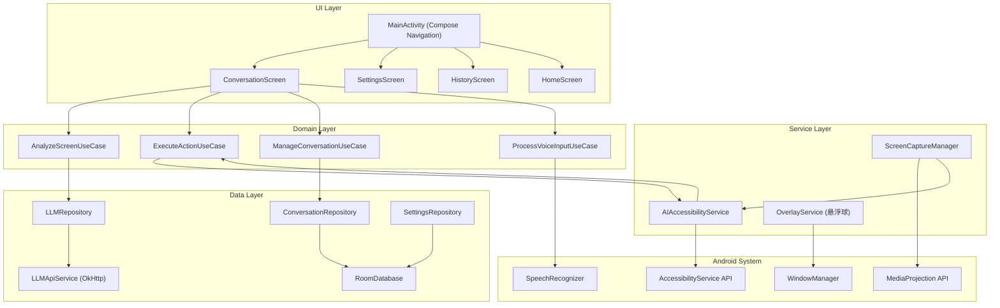
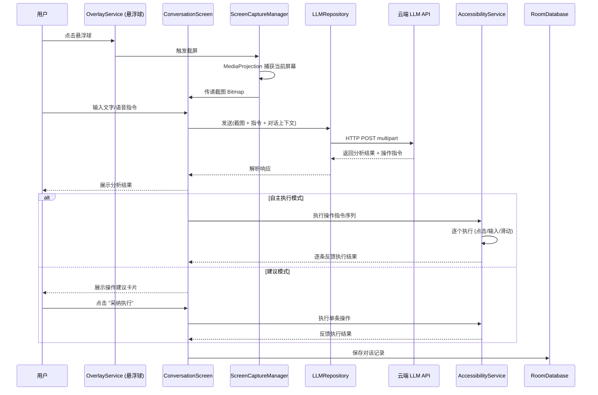

# AI 屏幕助手

Feature Name: ai-screen-assistant
Updated: 2026-06-23

## Description

AI 屏幕助手是一款 Android 客户端应用，通过 MediaProjection 截取屏幕内容，经由 AccessibilityService 理解界面结构和执行操作，将图像与用户自然语言指令发送至云端多模态 LLM，实现屏幕内容理解和自动化操作辅助。支持建议模式和自主执行模式双模式切换，提供悬浮球、语音输入等快捷交互入口。

## Architecture

### 分层架构



### 核心交互流



## Components and Interfaces

### 1. UI Layer (Jetpack Compose)

| 组件 | 职责 | 依赖 |
|------|------|------|
| `MainActivity` | 单 Activity 入口，管理 Compose Navigation | NavHost, ViewModels |
| `HomeScreen` | 主屏幕，功能入口导航 | - |
| `ConversationScreen` | 对话界面，消息列表 + 输入栏 + 模式切换 | ConversationViewModel |
| `SettingsScreen` | LLM 配置、权限管理、模式偏好 | SettingsViewModel |
| `HistoryScreen` | 对话历史列表和详情 | HistoryViewModel |
| `ModeSwitchChip` | 操作模式切换芯片组件 | ConversationViewModel |

### 2. Service Layer (Android Services)

**AIAccessibilityService**
- 继承 `AccessibilityService`
- 职责：读取 UI 树，执行模拟操作（点击、输入、滑动、返回、滚动）
- 对外接口：`performAction(Action): Result`
- 支持的操作类型：`ClickAction`, `InputTextAction`, `SwipeAction`, `BackAction`, `ScrollAction`

**OverlayService**
- 继承 `Service`，通过 `WindowManager` 添加系统级悬浮窗
- 职责：维护悬浮球的显示、拖拽、点击/长按事件
- 对外接口：通过 `EventBus` 发送悬浮球交互事件

**ScreenCaptureManager**
- 职责：管理 `MediaProjection` 生命周期，执行截屏
- 对外接口：`capture(): Bitmap?`
- 权限需求：`SYSTEM_ALERT_WINDOW` + 用户授权的 MediaProjection Intent

### 3. Domain Layer (Use Cases)

| Use Case | 输入 | 输出 | 对应需求 |
|----------|------|------|----------|
| `AnalyzeScreenUseCase` | Bitmap, String prompt, List<Message> history | AnalysisResult | R2 |
| `ExecuteActionUseCase` | List<Action> actions | Flow<ActionResult> | R4, R5 |
| `ManageConversationUseCase` | Conversation, Operation | Conversation | R9 |
| `ProcessVoiceInputUseCase` | AudioData | String (transcribed text) | R3 |
| `ValidateLLMConfigUseCase` | LLMConfig | ValidationResult | R8 |
| `SanitizeScreenUseCase` | Bitmap | Bitmap (password blurred) | R7 |

### 4. Data Layer

**LLMRepository**
- 封装对云 LLM API 的调用
- 接口：`analyze(image: Bitmap, prompt: String, history: List<Message>): Result<AnalysisResult>`
- 实现：OkHttp multipart POST，支持 OpenAI 兼容格式，可配置 base URL

**ConversationRepository**
- 接口：`getHistory(): Flow<List<ConversationSummary>>`, `getConversation(id): Conversation`, `delete(id)`
- 实现：Room DAO

**SettingsRepository**
- 接口：`getLLMConfig(): Flow<LLMConfig>`, `saveLLMConfig(config)`, `getOperationMode(): Flow<OperationMode>`
- 实现：Room + DataStore

## Data Models

### Conversation

```
Conversation {
    id: String (UUID)
    title: String
    createdAt: Long (timestamp)
    updatedAt: Long
    messages: List<Message>
    screenshots: List<ScreenRecord>
}
```

### Message

```
Message {
    id: String (UUID)
    role: Enum { USER, ASSISTANT }
    content: String
    analysisResult: AnalysisResult?   (nullable, only ASSISTANT)
    timestamp: Long
}
```

### AnalysisResult

```
AnalysisResult {
    screenDescription: String
    visibleElements: List<UIElement>
    suggestionText: String
    actions: List<Action>
}
```

### UIElement

```
UIElement {
    type: Enum { BUTTON, TEXT_FIELD, IMAGE, TEXT, SWITCH, LIST }
    label: String?
    bounds: Rect
    clickable: Boolean
    editable: Boolean
}
```

### Action (Sealed Class)

```
Action {
    // sealed subtypes:
    Click(x: Int, y: Int)
    LongClick(x: Int, y: Int)
    InputText(text: String, targetLabel: String?)
    Swipe(startX, startY, endX, endY, duration: Long)
    PressBack
    Scroll(direction: Direction, amount: Int)
    OpenApp(packageName: String)
}
```

### LLMConfig

```
LLMConfig {
    baseUrl: String
    apiKey: String
    modelName: String
    maxTokens: Int
    temperature: Float
}
```

### OperationMode

```
enum OperationMode {
    SUGGESTION,   // 建议模式
    AUTONOMOUS    // 自主执行模式
}
```

## Correctness Properties

1. **截屏完整性**: 截屏必须在用户触发后的 500ms 内完成图像数据准备，截取内容与实际屏幕完全一致。
2. **操作原子性**: 每次操作执行前后通过 AccessibilityService 校验 UI 树变化，操作完成后校验结果与预期一致。
3. **对话上下文一致性**: 对话历史中的 message 列表按 timestamp 严格递增，不可出现时间倒序。
4. **密码模糊不可逆**: 截屏发送前，`SanitizeScreenUseCase` 针对 `isPassword` 标志的 View 区域执行高斯模糊，模糊后区域原始内容不可恢复。
5. **模式状态一致性**: UI 显示的操作模式与实际执行逻辑保持同步，切换模式后立即生效，无竞态。模式偏好写入 DataStore 后，下次启动自动恢复。

## Error Handling

| 错误场景 | 处理策略 | 用户反馈 |
|----------|----------|----------|
| 网络不可用 | 请求入队列，监听网络恢复后重试 | 顶部横幅 "当前无网络连接" |
| LLM API 超时 (30s) | 自动取消请求，保留输入供重试 | Toast + 重试按钮 |
| LLM API 返回 4xx/5xx | 解析错误体，分类处理 | 错误详情卡片 + 重试 |
| 无障碍服务未开启 | 禁止自动操作，仅保留建议模式 | 引导弹窗跳转系统无障碍设置 |
| MediaProjection 权限丢失 | 退出截屏流程 | 权限引导弹窗 |
| AccessibilityService 操作超时 | 单步操作 5s 超时，记录失败 | 操作状态行标注失败 |
| 连续 3 次操作失败 | 暂停自动执行流程 | 对话框提示 "操作受阻，请手动介入" |
| 语音识别无结果 | 允许改用文字输入 | "未识别到语音，您可以输入文字" |
| 本地存储空间不足 | 清理最早的对话记录 (FIFO) | 下次进入历史页时提示 |
| 悬浮窗权限被系统回收 | 重新请求或在通知栏提供备选入口 | 通知栏入口 + 权限引导 |

## Test Strategy

### 单元测试

| 测试对象 | 覆盖重点 |
|----------|----------|
| `AnalyzeScreenUseCase` | 正确组装请求参数、处理 LLM 响应解析、异常场景 |
| `ExecuteActionUseCase` | Action 序列化/反序列化、操作执行状态流转 |
| `SanitizeScreenUseCase` | 密码区域检测准确性、模糊效果不泄露原始内容 |
| `ConversationRepository` | CRUD 操作正确性、分页查询 |
| `SettingsRepository` | LLMConfig 读写、OperationMode 持久化 |

### 集成测试

| 测试对象 | 覆盖重点 |
|----------|----------|
| `LLMRepository` + Mock LLM Server | 请求格式正确性、多模态参数传递、错误码处理 |
| `ConversationScreen` | 消息发送-响应完整流程、模式切换 UI 更新 |
| `HistoryScreen` | 列表加载、详情回看、删除操作 |

### UI 测试 (Compose Test)

| 测试对象 | 覆盖重点 |
|----------|----------|
| ConversationScreen | 消息气泡渲染、输入发送、模式切换芯片 |
| SettingsScreen | 表单输入验证、连接测试按钮 |
| ModeSwitchChip | 切换动画、模式标签变化 |

### 手动测试 / 设备测试

| 场景 | 验证方法 |
|------|----------|
| 悬浮球跨应用持久显示 | 在不同 App 间切换，确认悬浮球始终可见 |
| MediaProjection 截屏 | 在不同 App 界面截屏，对比原始画面 |
| AccessibilityService 操作执行 | 对已知 App 界面执行点击/输入/滑动，目视确认 |
| 密码模糊效果 | 在密码输入界面截屏，检查截图中密码区是否已模糊 |

## References

[^1]: (Android Developer Docs) - [MediaProjection API](https://developer.android.com/reference/android/media/projection/MediaProjection)
[^2]: (Android Developer Docs) - [AccessibilityService](https://developer.android.com/reference/android/accessibilityservice/AccessibilityService)
[^3]: (Android Developer Docs) - [SpeechRecognizer](https://developer.android.com/reference/android/speech/SpeechRecognizer)
[^4]: (OpenAI Docs) - [Vision API (GPT-4o)](https://platform.openai.com/docs/guides/vision)
